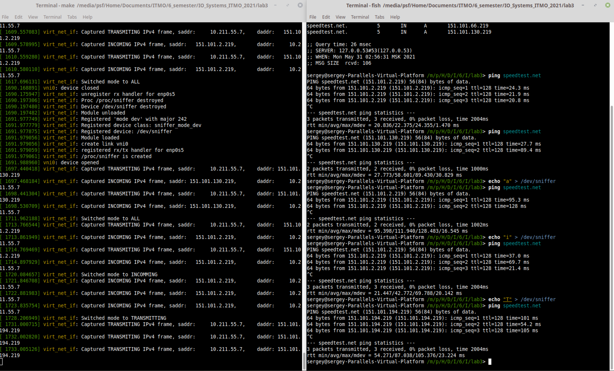

# Лабораторная работа 3

**Название:** "Разработка драйверов сетевых устройств"

**Цель работы:** Получить знания и навыки разработки драйверов сетевых интерфейсов для операционной системы Linux.

## Описание функциональности драйвера

Драйвер создает виртуальный сетевой интерфейс, поверх родительского, реального физического интерфейса OS Linux.
В соответствии с вариантом №2, драйвер  перехватывает и обрабатывает IPv4 пакеты родительского интерфейса по заранее заданному целевому адресу. 

Имееться возможность просмотра статистики перхваченных пакетов через чтение файла procfs. А также, драйвер выводит логи перехваченных пакетов в кольцевой буфер ядра.

## Инструкция по сборке

## Инструкция по сборке

1. Компиляция проекта - `make all`
2. Загрузка модуля в ядро - `make install`
3. Выгрузка модуля из ядра - `make remove`
4. Удаление объектных файлов - `make clean`
5. Выполнение всех этих действий в порядке 3-4-1-2 - `make recompile`

## Инструкция пользователя

0. Тестовая передача IPv4 пакетов - `ping <destination address>`
1. Просмотр логов ядра - `make show_logs`
2. Вывод статистики - `cat /proc/sniffer`
3. Смена режима сниффера - `echo 'A' > /dev/sniffer` (A - All, I - Incomming, T - Transmitting)

## Примеры использования

`> make all` - сборка драйвера

```bash
make -C /lib/modules/4.15.0-20-generic/build M=/media/psf/Home/Documents/ITMO/6_semester/IO_Systems_ITMO_2021/lab3 modules
make[1]: Entering directory '/usr/src/linux-headers-4.15.0-20-generic'
  CC [M]  /media/psf/Home/Documents/ITMO/6_semester/IO_Systems_ITMO_2021/lab3/virt_net_if.o
  Building modules, stage 2.
  MODPOST 1 modules
  CC      /media/psf/Home/Documents/ITMO/6_semester/IO_Systems_ITMO_2021/lab3/virt_net_if.mod.o
  LD [M]  /media/psf/Home/Documents/ITMO/6_semester/IO_Systems_ITMO_2021/lab3/virt_net_if.ko
make[1]: Leaving directory '/usr/src/linux-headers-4.15.0-20-generic'
```

`make install` - загрузка драйвера и выдача ip-адреса интерфейсу

```bash
sudo insmod virt_net_if.ko
sudo ifconfig vni0 up
sudo dhclient vni0
```

`make show_logs` - логи после создания драйвера

```log
[  170.863672] virt_net_if: Module loaded
[  170.863673] virt_net_if: create link vni0
[  170.863673] virt_net_if: registered rx handler for enp0s5
[  170.863676] virt_net_if: /proc/sniffer is created
```

`cat /proc/sniffer` - статистика до обращений

```
1 TARGET IP ADDRESS: 151.101.2.219
2 TARGET IP ADDRESS: 151.101.194.219
3 TARGET IP ADDRESS: 151.101.130.219
4 TARGET IP ADDRESS: 151.101.66.219
--- STATS ---
RX = 0 packets (0 bytes)
TX = 0 packets (0 bytes)
```

`ping -c 5 speedtest.net` - пингем таргет сервер'a

```
PING speedtest.net (151.101.194.219) 56(84) bytes of data.
64 bytes from 151.101.194.219 (151.101.194.219): icmp_seq=1 ttl=128 time=32.7 ms
64 bytes from 151.101.194.219 (151.101.194.219): icmp_seq=2 ttl=128 time=38.1 ms
64 bytes from 151.101.194.219 (151.101.194.219): icmp_seq=3 ttl=128 time=35.5 ms
64 bytes from 151.101.194.219 (151.101.194.219): icmp_seq=4 ttl=128 time=37.9 ms
64 bytes from 151.101.194.219 (151.101.194.219): icmp_seq=5 ttl=128 time=46.8 ms
```

`make show_logs` - логи после 5-кратного пинга

```log
[  429.176578] virt_net_if: Captured TRANSMITING IPv4 frame, saddr:     10.211.55.7,	daddr: 151.101.194.219
[  429.209280] virt_net_if: Captured INCOMING IPv4 frame, saddr: 151.101.194.219,	daddr:     10.211.55.7
[  430.177620] virt_net_if: Captured TRANSMITING IPv4 frame, saddr:     10.211.55.7,	daddr: 151.101.194.219
[  430.215727] virt_net_if: Captured INCOMING IPv4 frame, saddr: 151.101.194.219,	daddr:     10.211.55.7
[  431.179958] virt_net_if: Captured TRANSMITING IPv4 frame, saddr:     10.211.55.7,	daddr: 151.101.194.219
[  431.215421] virt_net_if: Captured INCOMING IPv4 frame, saddr: 151.101.194.219,	daddr:     10.211.55.7
[  432.181659] virt_net_if: Captured TRANSMITING IPv4 frame, saddr:     10.211.55.7,	daddr: 151.101.194.219
[  432.219574] virt_net_if: Captured INCOMING IPv4 frame, saddr: 151.101.194.219,	daddr:     10.211.55.7
[  433.181999] virt_net_if: Captured TRANSMITING IPv4 frame, saddr:     10.211.55.7,	daddr: 151.101.194.219
[  433.228820] virt_net_if: Captured INCOMING IPv4 frame, saddr: 151.101.194.219,	daddr:     10.211.55.7
```

[Тест на данном сайте](https://speedtest.net)


`cat /proc/sniffer` - статистика после теста

```
1 TARGET IP ADDRESS: 151.101.2.219
2 TARGET IP ADDRESS: 151.101.194.219
3 TARGET IP ADDRESS: 151.101.130.219
4 TARGET IP ADDRESS: 151.101.66.219
--- STATS ---
RX = 150723 packets (161458661 bytes)
TX = 153573 packets (144248975 bytes)
```

```bash
echo 'a' > /dev/sniffer
ping speedtest.net

echo 'i' > /dev/sniffer
ping speedtest.net

echo 't' > /dev/sniffer
ping speedtest.net
```

